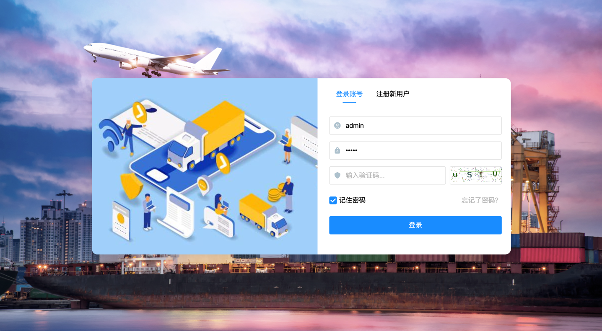
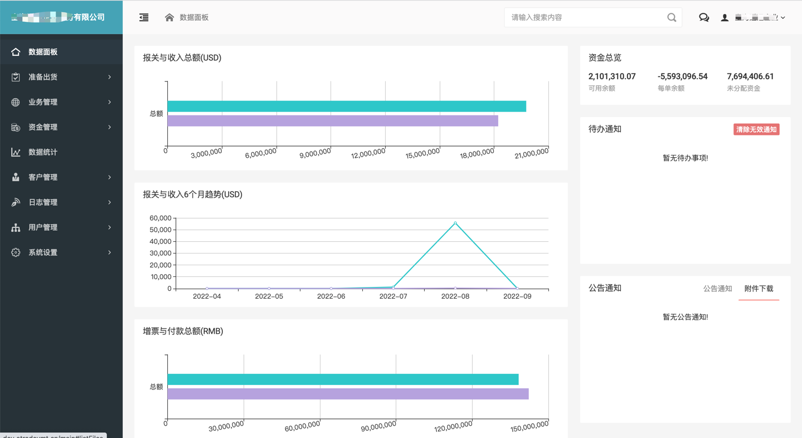
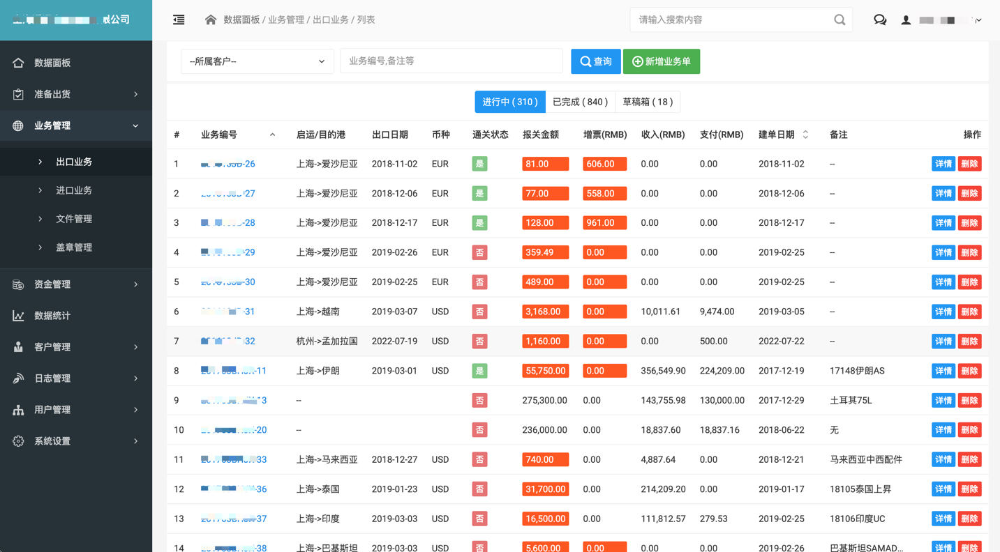
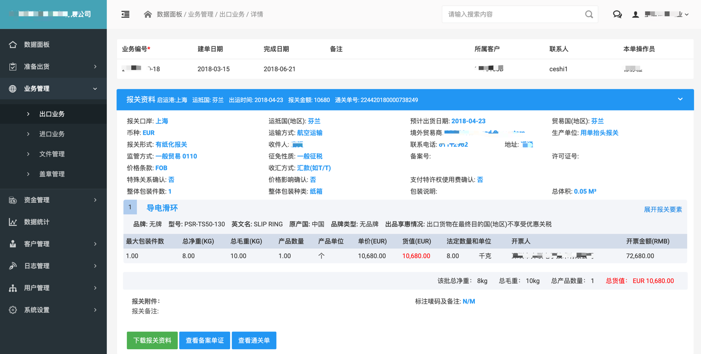
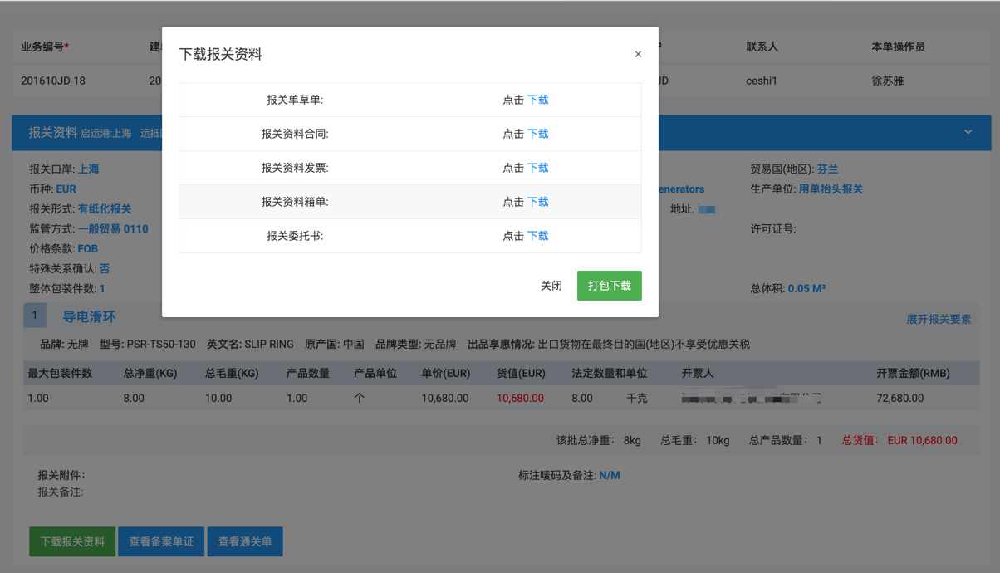
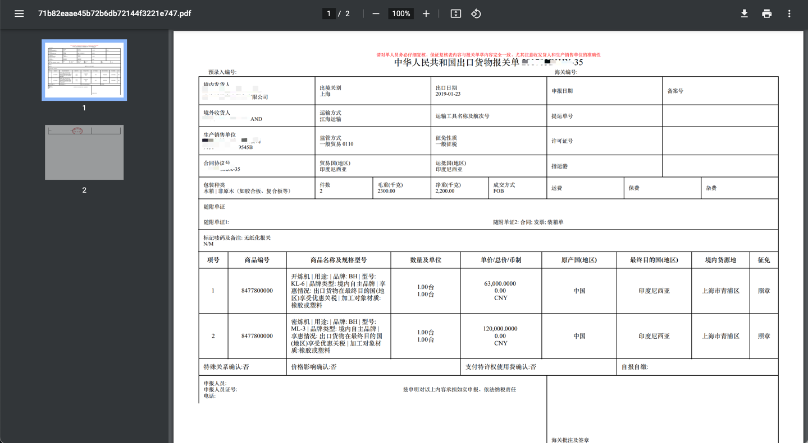
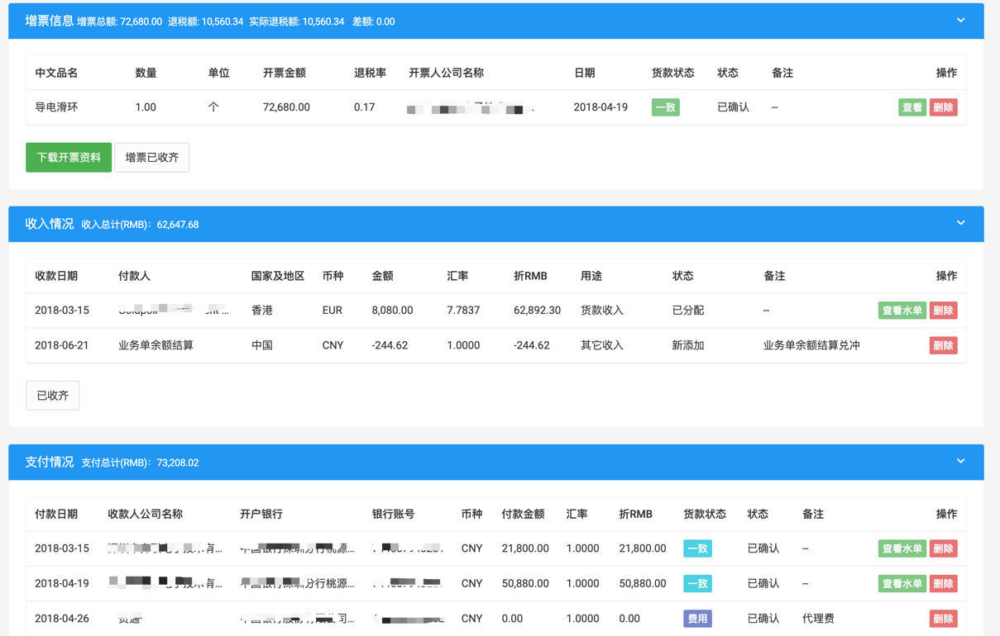
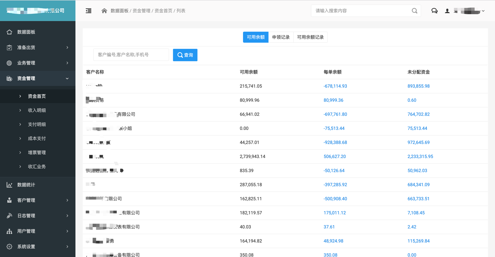
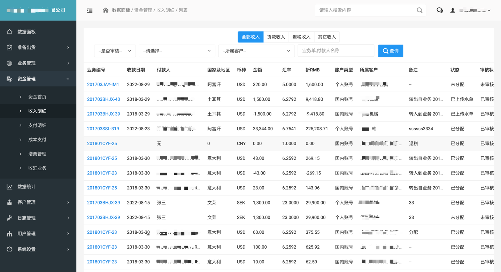
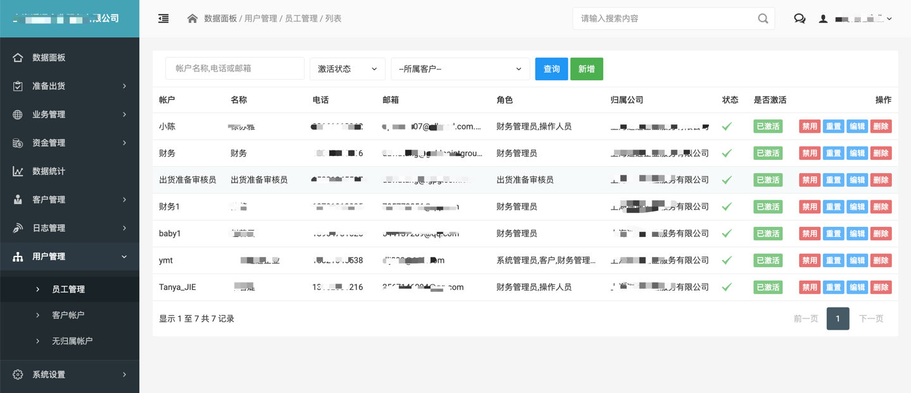

# etrade进出口报关系统

#### 介绍
小企业代理进出口报关, 记录进出口报关流程及文件等.

#### 软件架构
软件架构说明
使用PHP7.4 , CI4框架进行开发

#### 安装教程

1.  codeigniter4 框架
2.  框架地址: https://codeigniter.org.cn/
3.  安装系统所需插件 htmltopdf , unoconv 
4.  安装composer , 在项目根目录执行  **composer install**
5.  安装 dompdf 字体: php load_font.php SimSun SimSun.ttf
#### 使用说明
系统登录

数据面板

出口管理

下载报关资料

报关其它信息

资金管理 

帐户管理 

具体功能,就不一一列举了

欢迎大家下载学习交流

**系统演示地址:**

http://demo.vdump.cn
帐户: admin
密码: 123456

如需商用, 请邮件dlj899@163.com与我联系! 
